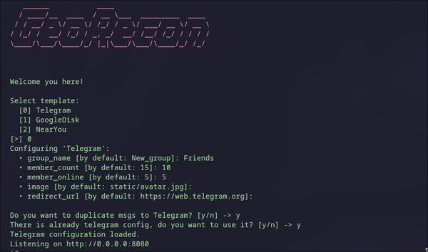
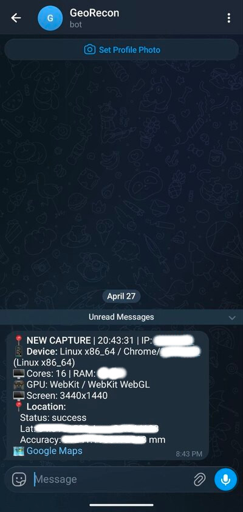

# GeoRecon

Asynchronous geolocation capture service for OSINT investigations. Serve convincing phishing pages to capture visitor device information and GPS coordinates.

<table>
  <tr>
    <td align="center"></td>
    <td align="center"></td>
    <td align="center"></td>
  </tr>
  <tr>
    <td align="center"><b>CLI Interface</b></td>
    <td align="center"><b>Telegram Template</b></td>
    <td align="center"><b>NearYou Template</b></td>
  </tr>
  <tr>
    <td align="center"></td>
    <td align="center"></td>
    <td></td>
  </tr>
  <tr>
    <td align="center"><b>Google Disk Template</b></td>
    <td align="center"><b>Telegram Bot</b></td>
    <td></td>
  </tr>
</table>

## Features

- **Geolocation Capture** – Obtain precise GPS coordinates from visitors via browser Geolocation API
- **Device Fingerprinting** – Collect OS, browser, CPU cores, RAM, GPU info, screen resolution
- **Telegram Integration** – Optional real-time notifications to your Telegram bot
- **Multiple Templates** – Comes with Telegram, Google Disk, and NearYou templates
- **CLI + Config File** – Configurable via CLI arguments or YAML file
- **Clean Formatted Output** – Colored CLI logs with device/location data

## Requirements

- Python 3.12+
- A modern browser with Geolocation API support (victim's browser)

## Installation

### From PyPI (recommended)

```bash
pip install georecon
# or
uv add georecon
```

### From source

```bash
git clone https://github.com/MarkLevkovich/geo-recon.git
cd geo-recon
pip install .
```

## Usage

### Quick Start

```bash
georecon
```

### CLI Options

```bash
georecon --host 127.0.0.1 --port 8080           # Custom host/port
georecon --config /path/to/config.yaml         # Use config file
georecon --log-level debug                     # Verbose logging
georecon --no-access-log                     # Disable access logs
```

### Configuration File

Create `geoconf.yaml` (or any path):

```yaml
host: "0.0.0.0"
port: 8080
log_level: "info"
no_access_log: false
```

CLI arguments override config file values.

## Telegram Bot Setup

### 1. Create a bot

1. Open [@BotFather](https://t.me/BotFather) in Telegram
2. Send `/newbot`
3. Follow the instructions to get your bot token

### 2. Get your chat ID

1. Start a conversation with your bot
2. Send any message to the bot
3. Visit `https://api.telegram.org/bot<TOKEN>/getUpdates`
4. Find `"chat":{"id":123456789` in the JSON response – that's your chat ID

### 3. Configure GeoRecon

When running `georecon`, you'll be prompted:

```
Do you want to duplicate msgs to Telegram? [y/n] -> y
=== Telegram bot setup ===
Enter bot token: 123456789:ABCdefGHIjklMNOpqrSTUvw
Enter target chat ID (numeric): 123456789
```

Configuration is saved to `~/.geo_recon.conf`.

## Exposing to Internet

By default, the server binds to `0.0.0.0:8080`. To make it accessible from the internet, you need to expose your local server.

### Option 1: ngrok

```bash
ngrok http 8080
```

Copy the generated URL (e.g., `https://abc123.ngrok.io`) and share it with your target.

### Option 2: Cloudflare Tunnel

1. Install cloudflared:

```bash
# Arch Linux
sudo pacman -S cloudflared

# Ubuntu/Debian
curl -L https://github.com/cloudflare/cloudflared/releases/latest/download/cloudflared-linux-amd64 -o /usr/local/bin/cloudflared
chmod +x /usr/local/bin/cloudflared
```

2. Create a tunnel:

```bash
cloudflared tunnel create my-geo-tunnel
```

3. Run the tunnel:

```bash
cloudflared tunnel --url http://localhost:8080 run my-geo-tunnel
```

Copy the generated `.cloudflared.io` URL.

### Captured Data

- IP address
- Operating system
- Browser & platform
- CPU cores & RAM
- GPU vendor/renderer
- Screen resolution
- Latitude / Longitude
- Accuracy
- City / Country (if available)
- Google Maps link

## Tested On

- **Arch Linux** – Full compatibility

## License

MIT License – see [LICENSE](LICENSE)